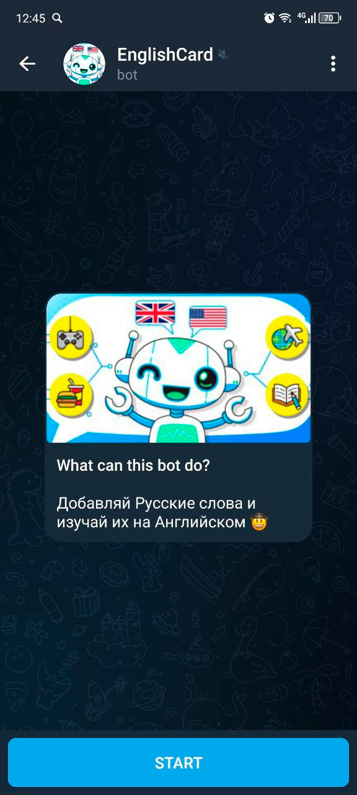
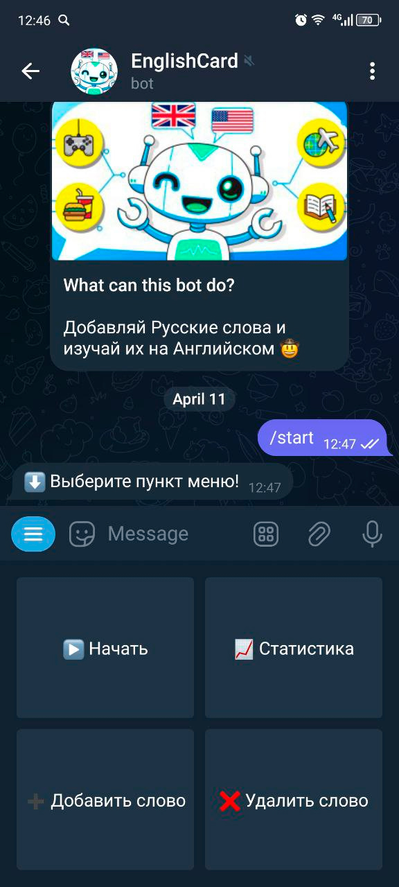
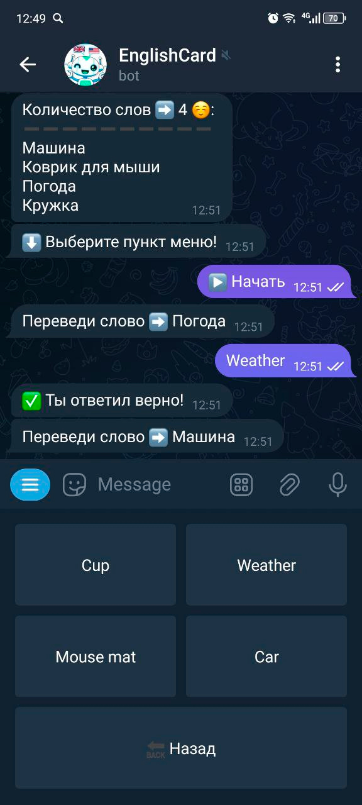
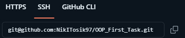
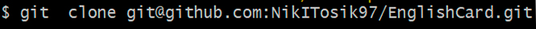

## EmglishCard TelegramBot

## Что я умею? 🧐

- Принимать от тебя Русские слова которые ты хочешь изучить на Английском.
- Удалять слова из твоего списка слов, которые ты уже изучил.
- Выводить статистику твоего списка изучаемых слов.
- Отправлять тебе в чат Русское слово, и предлагать 4 варианта ответа на Английском.

---

Как я выгляжу 😎

___

## Как меня включить? 😏

1. Перейди на **GitHub** с моим проектом [emglishcard_project](https://github.com/NikITosik97/EnglishCard.git)
2. 🔽 Нажми на **Code**, затем **Local** и скопируй **SSH** ключ 🔽

3. Сделай **git clone** репозитория

4. Открой проект в любой для тебя удобной IDE, например **PyCharm**.
5. Создай базу данных с именим **telebotTranslateWords**

`createdb -U postgres telebotTranslateWords`

6. Установи все зависимости проекта из файла **requirements.txt** командой

`pip install -U -r requirements.txt`

7. Из пакета **database** запусти `create_tables.py` и затем `update_general_words.py`
8. В `config.py` вставь свой `YANDEX TOKEN` получить его
   можно [тут](https://yandex.ru/dev/dictionary/keys/get/?service=dict)
9. Запусти исполняемый файл `main.py`

___

[***Реализовано с помощью сервиса «Яндекс.Словарь***](https://yandex.ru/dev/dictionary/)

[***Developer's YouTube channel***](https://www.youtube.com/@nikitosikdeveloper/videos)

